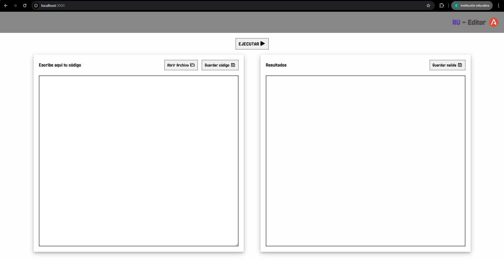
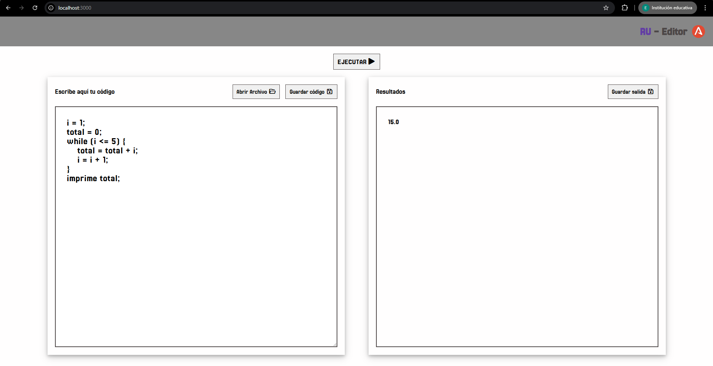
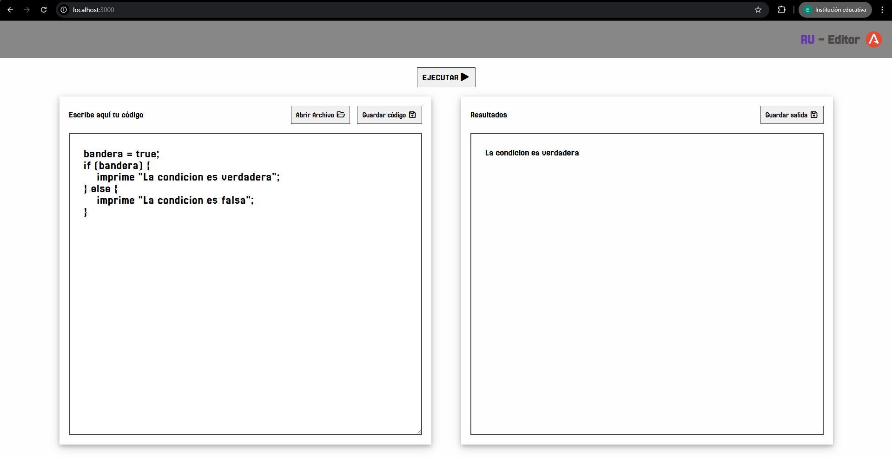
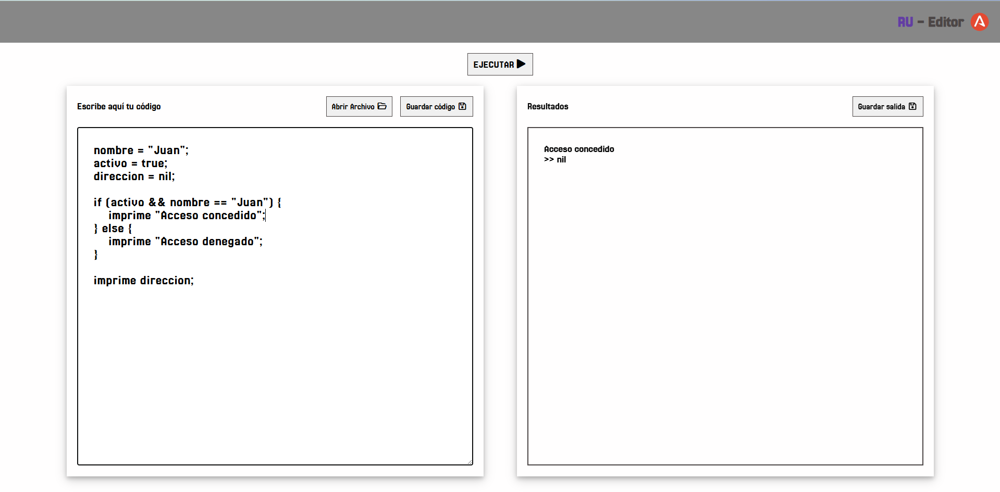
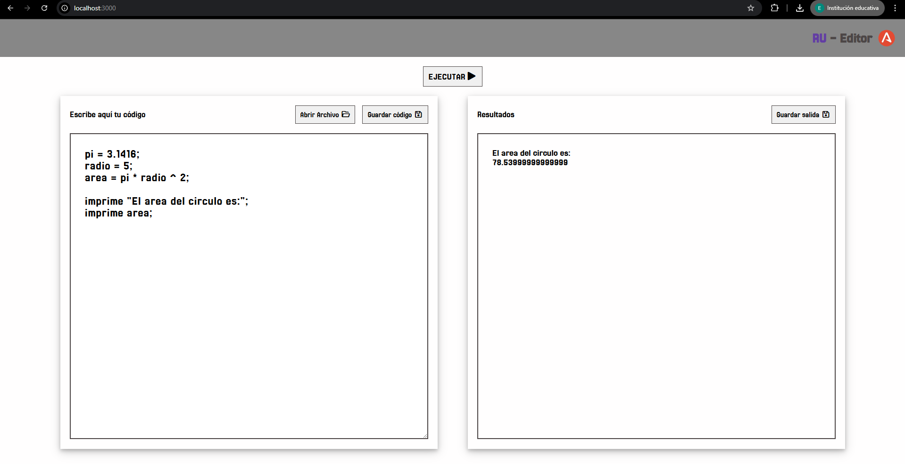
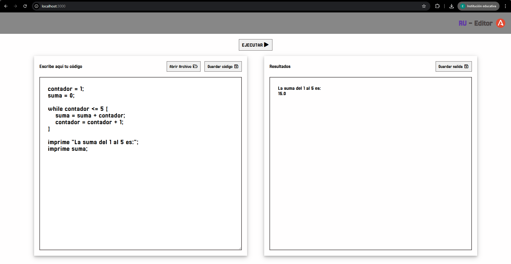
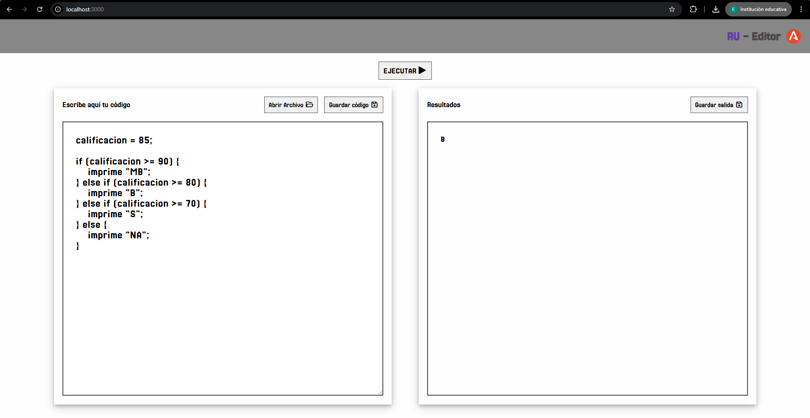

# TAREA 4 - FINAL
## Eduardo González González
## Universidad Autónoma Metropolitana
## UEA - Traductores 25P

**RU Editor** es una aplicación web diseñada para escribir, evaluar y depurar código escrito en el lenguaje *Ru*, un lenguaje personalizado desarrollado con ANTLR4.

Este proyecto cuenta con:

- ✍️ Un **editor web** hecho con HTML, CSS y JavaScript para escribir código Ru.
- 🧠 Un **intérprete** en Java que utiliza ANTLR para parsear y evaluar el código.
- ⚙️ Un **backend en Node.js** que conecta el editor web con el intérprete.
- 📦 Soporte para operaciones aritméticas, booleanas, estructuras condicionales (`if`, `else`), bucles (`while`), variables, impresión y manejo de errores sintácticos.

El sistema fue diseñado como una herramienta educativa y experimental para entender el funcionamiento de analizadores léxicos, sintácticos y semánticos mediante ANTLR, y cómo integrarlos en una aplicación web moderna.

### MyVisitor.java
Este archivo define un visitor personalizado responsable de recorrer el árbol de sintaxis generado por ANTLR para el lenguaje RU. Su propósito es evaluar las distintas estructuras del lenguaje, como sentencias, expresiones, 
condicionales y bucles, manteniendo una tabla de variables en memoria para gestionar el estado de la ejecución. Forma parte esencial del backend del editor web de código RU, permitiendo interpretar y ejecutar los programas 
escritos en dicho lenguaje. 

### Launcher.java
Este archivo representa el punto de entrada principal del backend para el lenguaje RU. Su función es leer el código fuente desde la entrada estándar, pasarlo al lexer y parser generados por ANTLR, y construir el árbol de sintaxis. 
Durante este proceso, redirige los errores sintácticos a una salida temporal para capturarlos y mostrarlos de forma controlada. Si no se detectan errores, el árbol se recorre utilizando el visitor personalizado (MyVisitor), 
que se encarga de ejecutar el programa. Este archivo permite integrar el procesamiento del lenguaje RU con el servidor web y facilita su ejecución desde línea de comandos o desde un entorno web.

### 🧭 Flujo de trabajo entre backend y frontend

1. El usuario escribe código RU en el editor web (frontend)
Desde el navegador, el usuario escribe un programa en el lenguaje RU dentro de un área de texto `(textarea)` ofrecida por el frontend. Este código puede incluir asignaciones, condicionales, bucles, impresiones, etc.


2. Al presionar el botón de "Evaluar"
   Se dispara una función JavaScript (`evaluar()`) que recoge el contenido del editor y lo envía al servidor mediante una solicitud HTTP `POST` al endpoint `/ejecutar`


3. El servidor Express recibe la solicitud (`index.js`)
   El backend en Node.js guarda el código recibido en un archivo temporal llamado `entrada.txt` y luego ejecuta un comando en consola para interpretar ese archivo usando Java:
```bash
  type entrada.txt | java -cp "antlr-4.13.2-complete.jar;out/production/Tarea4_Final" Launcher
```
4. Java ejecuta el archivo `Launcher.java`
   Este archivo se encarga de:
   * Leer el contenido de `entrada.txt`. 
   * Pasarlo al lexer y parser generados por ANTLR.
   * Detectar errores de sintaxis y devolverlos si existen.
   * Si no hay errores, recorre el árbol sintáctico con `MyVisitor.java`.


5. El visitor (`MyVisitor.java`) evalúa el programa
   Se ejecutan las instrucciones del programa RU según las reglas implementadas en `MyVisitor`. Por ejemplo:
   * Se almacenan variables. 
   * Se evalúan expresiones. 
   * Se manejan estructuras como `if, while, imprime`.
   

6. El resultado (o errores) se devuelve al servidor
   El `Launcher` imprime los resultados o errores a la salida estándar, que el servidor Node captura y envía como respuesta al frontend.


7. El frontend muestra la salida al usuario
   La función `evaluar()` en `app.js` toma la respuesta y la muestra en pantalla dentro del área de salida. Si contiene errores, se resalta visualmente en rojo. Si es válido, se formatea línea por línea.


### Analizador léxico (lexer)
El analizador léxico (RuLexer) es generado automáticamente por ANTLR a partir de la gramática Ru.g4. Su tarea es leer el código fuente y dividirlo en una secuencia de tokens léxicos, como identificadores (ID), 
operadores (+, *, ==), números (INT, FLOAT), palabras reservadas (if, while, imprime, etc.) y símbolos de control ({, }, ;, etc.).


### Analizador sintáctico (parser)
El parser (RuParser) también es generado por ANTLR. Toma los tokens proporcionados por el lexer y verifica si la estructura del programa es válida según las reglas gramaticales. Si el código fuente cumple 
con la sintaxis del lenguaje RU, se construye un árbol de análisis sintáctico (AST). Si hay errores, estos se informan.

### Manejador de errores
Los errores léxicos o sintácticos se redirigen desde System.err y son capturados por el Launcher.java, que los transforma en salidas visibles para el usuario. Esto permite mostrar errores personalizados desde el frontend.

### Backend (Launcher.java y Node.js)
El archivo Launcher.java actúa como el punto de entrada del backend. Recibe el código fuente por stdin, lo analiza y lo interpreta usando ANTLR y el MyVisitor.

El archivo index.js (Node.js con Express) se encarga de:
* Recibir el código fuente desde el frontend (por fetch)
* Guardarlo en un archivo temporal (entrada.txt)
* Ejecutar el Launcher.java usando exec()
* Capturar y retornar la salida o errores


### Frontend (JavaScript, HTML)
La interfaz web permite al usuario:
* Escribir código en el lenguaje RU 
* Ejecutar el código con un botón 
* Ver la salida o errores 
* Cargar y descargar archivos .ru o .txt

## Clases e instancias utilizadas
| Clase / Archivo     | Descripción                                                    |
|---------------------|----------------------------------------------------------------|
| RuLexer             | Lexer generado por ANTLR. Divide el código fuente en tokens.   |
| RuParser            | Parser generado por ANTLR. Construye el AST.                   |
| MyVisitor           | Visitor personalizado que interpreta el árbol sintáctico.      |
| Launcher            | Punto de entrada en Java. Ejecuta análisis y evalúa código RU. |
| index.js            | Backend en Node.js. Conecta frontend con el Launcher.          |
| frontend/index.html | Interfaz visual del editor.                                    |
| frontend/app.js     | Lógica del editor en el navegador.                             |

## 🧑‍💻 Instrucciones de uso
### Requisitos previos
Se requiere tener instalado:
* `Node.js` (v14 o superior)
* `Java JDK` (v11 o superior)
* `ANTLR` 4.13.2

En la carpeta raíz del proyecto ejecutar:
```bash
  cd Tarea4_Final
```
Después es necesario compilar el código Java con ANTLR
```bash
  javac -cp "antlr-4.13.2-complete.jar" src/*.java -d out/production/Tarea4_Final
```

Ahora, es necesario ejecutar el servidor de Node.js, para eso usar el siguiente comando:
```bash
  node index.js
```
Esto levantará el servidor en esta url: `http://localhost:3000`

## Usar el editor web
   1. Abre tu navegador y dirigete a:
   👉 http://localhost:3000
   2. Escribe o carga tu código RU en el editor. 
   3. Presiona el botón "Ejecutar" para interpretar el código. 
   4. La salida del programa o los errores aparecerán en la parte inferior del editor.
### Funcionalidades disponibles

   ✍️ `Escribir código RU` directamente en el área de texto. 

   📂 `Cargar archivos .ru` desde tu PC. 

   💾 `Descargar tu código` con extensión .ru. 

   📤 `Guardar salida o resultados` en un archivo .txt.
   

## Interfaz


## Ejemplos de prueba
* Código de prueba 1:
  ```text
    i = 1;
    total = 0;
    while (i <= 5) {
        total = total + i;
        i = i + 1;
    }
    imprime total;
    ```
  `Salida: 15.0`

  


* Código de prueba 2:
    ```text
    bandera = true;
    if (bandera) {
        imprime "La condicion es verdadera";
    } else {
        imprime "La condicion es falsa";
    }
    ```
  `Salida: La condicion es verdadera`

    


* Código de prueba 3:
    ```text
    nombre = "Juan";
    activo = true;
    direccion = nil;
    
    if (activo && nombre == "Juan") {
        imprime "Acceso concedido";
    } else {
        imprime "Acceso denegado";
    }
    imprime direccion;
    ```
    `Salida: Acceso concedido >> nil`
    

* Código de prueba 4:
    ```text
    pi = 3.1416;
    radio = 5;
    area = pi * radio ^ 2;
    
    imprime "El area del circulo es:";
    imprime area;
  ```
  `Salida: El área del círculo es: 78.5399`
    

* Código de prueba 5:
    ```text
    contador = 1;
    suma = 0;
    
    while contador <= 5 {
    suma = suma + contador;
    contador = contador + 1;
    }
    
    imprime "La suma del 1 al 5 es:";
    imprime suma;
    ```
  `Salida: La suma del 1 al 5 es: 15.0`
    

* Código de prueba 6:
  ```text
   calificacion = 85;
   if (calificacion >= 90) {
    imprime "MB";
   } else if (calificacion >= 80) {
    imprime "B";
   } else if (calificacion >= 70) {
    imprime "S";
   } else {
    imprime "NA";
   }
  ```
    `Salida: B`
  